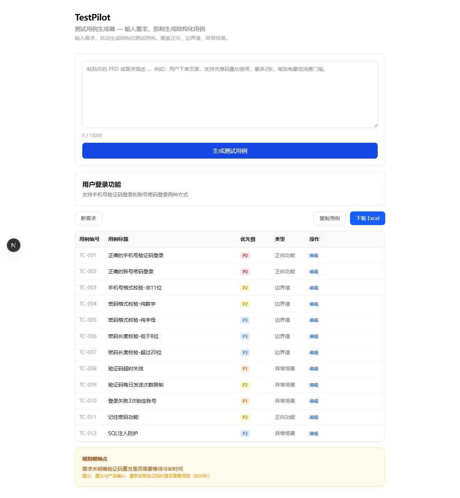

# TestPilot

AI 驱动的测试用例生成器 — 粘贴 PRD，秒出结构化用例。

## 为什么需要 TestPilot

一个中等复杂度的功能，QA 工程师通常需要花一整天手写 50-100 条测试用例，质量高度依赖个人经验。TestPilot 把「从 0 到草稿」压缩到秒级，让 QA 把精力花在评审和优化上，而不是从空白页开始。

## 效果预览



## 核心功能

- **需求 → 用例**：粘贴 PRD 或需求描述，AI 自动生成结构化测试用例（含编号、标题、前置条件、步骤、预期结果、优先级、类型）
- **截图辅助**：支持粘贴截图，多模态分析需求文档中的 UI 原型
- **模糊点检测**：AI 自动标注需求中的歧义或矛盾之处，并向产品提出确认建议
- **在线编辑**：生成后可在表格中直接修改标题、步骤、预期结果、优先级、类型
- **多格式导出**：一键复制格式化文本，或下载带样式的 Excel (.xlsx)
- **多模型可插拔**：基于 OpenAI SDK 标准协议，改环境变量即可在 DeepSeek、GPT、Claude、Qwen 等模型间切换

## 快速开始

```bash
git clone https://github.com/huangdashuo99-dev/caseforge.git
cd caseforge/testpilot
npm install
```

创建 `.env.local`：

```env
# 必填 — AI 提供商配置（文本模型）
AI_API_KEY=your-api-key
AI_BASE_URL=https://api.deepseek.com/v1
AI_MODEL=deepseek-chat

# 可选 — 多模态模型（处理截图时使用，不配置则回退到文本模型）
AI_VISION_API_KEY=your-vision-api-key
AI_VISION_BASE_URL=https://api.openai.com/v1
AI_VISION_MODEL=gpt-4o

# 可选 — 主模型失败时自动切换备用模型
AI_FALLBACK_API_KEY=your-fallback-key
AI_FALLBACK_BASE_URL=https://dashscope.aliyuncs.com/compatible-mode/v1
AI_FALLBACK_MODEL=qwen-plus
```

```bash
npm run dev
```

打开 [http://localhost:3000](http://localhost:3000)，粘贴需求，点击「生成用例」。

## 环境变量

| 变量 | 必填 | 说明 |
|---|---|---|
| `AI_API_KEY` | 是 | AI 服务商的 API Key |
| `AI_BASE_URL` | 否 | API 地址（默认 DeepSeek） |
| `AI_MODEL` | 否 | 模型名称（默认 `deepseek-chat`） |
| `AI_VISION_API_KEY` | 否 | 多模态模型 API Key（处理截图） |
| `AI_VISION_BASE_URL` | 否 | 多模态 API 地址 |
| `AI_VISION_MODEL` | 否 | 多模态模型名称 |
| `AI_FALLBACK_API_KEY` | 否 | 备用模型 API Key（主模型失败时自动切换） |
| `AI_FALLBACK_BASE_URL` | 否 | 备用模型 API 地址 |
| `AI_FALLBACK_MODEL` | 否 | 备用模型名称 |

主模型失败时，系统会自动尝试备用模型（如果已配置），无需用户感知。

## 技术栈

| 层 | 技术 |
|---|---|
| 框架 | Next.js 16 (App Router) |
| UI | React 19 + Tailwind CSS v4 |
| 语言 | TypeScript |
| AI SDK | OpenAI SDK v6（兼容所有 OpenAI 格式 API） |
| 导出 | exceljs |
| 单元测试 | Vitest + Testing Library |
| E2E 测试 | Playwright |
| 部署 | Vercel |

## 项目结构

```
testpilot/
├── app/
│   ├── page.tsx                  # 主页面（输入、生成、编辑、导出）
│   ├── layout.tsx                # 根布局
│   ├── globals.css               # 全局样式
│   └── api/generate/route.ts     # POST /api/generate
├── lib/
│   ├── ai-provider.ts            # AI 调用层（重试 + 备用链 + 优先级校验）
│   ├── json-parser.ts            # JSON 解析（容错 + 校验 + 规范化）
│   └── rate-limit.ts             # 频率限制（MVP 桩，可替换为 Vercel KV）
├── prompts/
│   └── test-case-generator.md    # 系统提示词
├── eval/
│   └── requirements.json         # 5 个标准评估需求样例
├── test/                         # 单元测试
├── e2e/                          # E2E 测试
└── public/                       # 静态资源
```

## 脚本

```bash
npm run dev        # 启动开发服务器
npm run build      # 生产构建
npm run start      # 启动生产服务
npm test           # 运行单元测试
npm run test:e2e   # 运行 E2E 测试
npm run lint       # 代码检查
```

## 工作原理

1. 用户在页面输入需求文本（可选粘贴截图）
2. 前端 POST 到 `/api/generate`，附带文本和图片
3. 服务端调用 AI 模型，使用精心调校的系统提示词生成结构化 JSON
4. JSON 经容错解析器处理（去除 markdown 标记、修复尾部逗号、校验 schema）
5. 校验优先级分布（P0~P4 符合预设比例），不达标自动重试
6. 返回结果在前端渲染为可编辑表格，支持复制和 Excel 导出

## License

MIT
